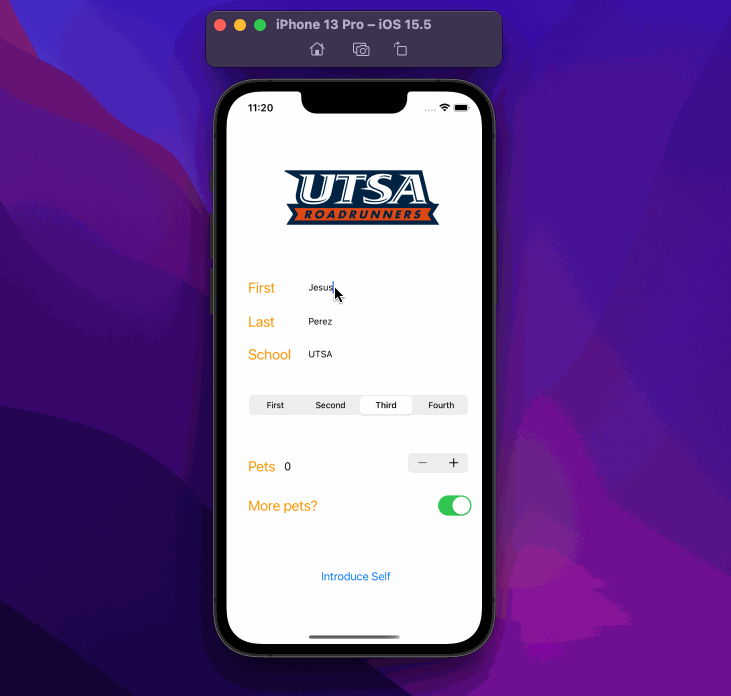

## UTSA School App

### App Description

The app will allow us to introduce ourselves by accepting user inputs in various forms, such as switches, text fields, segmented controls, and more. After user input has been filled it will print back the information shown.

### App Walk-though

 

### Required Features

- [X] 1. App displays an image of a school's logo
- [X] 2. App has three textfields for first, last, and school names
- [X] 3. App has a segmented control that changes student year
- [X] 4. Number of pet matches label is increased/decreased by stepper
- [X] 5. Switch makes a statement about wanting more pets or not(true/false) 
- [X] 6. Introduce yourself button shows alert box with an introduciton and dismiss button

### Optional Features

- [X] 1. Changed text colors and text field sizes
